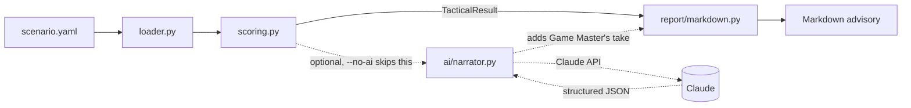

# Architecture

TacticalDirector is deliberately split into a deterministic core and an optional AI layer, so the tool is fully usable, testable, and free to run without ever calling an external API. Same split as [RiskLens](https://github.com/Barak-Nisim/risklens) and [MarketSignal](https://github.com/Barak-Nisim/marketsignal); RiskLens ranks security findings, MarketSignal ranks signal categories, TacticalDirector ranks tactical actions.

## Why it's split this way

- **`scoring.py` is pure**: no I/O, no network calls, no randomness. Given the same encounter, it always produces the same `TacticalResult`. That's what makes it fully unit-testable and defensible in an interview: you can walk through every scoring rule by hand.
- **`ai/narrator.py` only narrates, never scores.** It receives the already-ranked `TacticalResult` as structured JSON and is explicitly instructed not to recompute or reorder the rankings, and not to invent enemies or rules that weren't given to it. The AI layer can be swapped, removed, or mocked without touching the scoring logic at all.
- **The CLI (`cli.py`) is the only place these pieces are wired together.** `--no-ai` skips the network call entirely, which is what the test suite and CI use. TacticalDirector's own tests never spend a cent or depend on network access.

## Data flow

1. `loader.py` parses a scenario YAML file (character, enemies, terrain) into the dataclasses in `models.py`.
2. `scoring.py` evaluates all four actions against all four categories, averages each action's category scores, and sorts the actions highest-first.
3. `report/markdown.py` renders the deterministic result. If AI narration was requested, `ai/narrator.py` is called with the structured ranked actions and its output is merged into the same report.
4. `web/app.py` is a thin FastAPI wrapper around the same three modules; no scoring or narration logic lives in the web layer.
